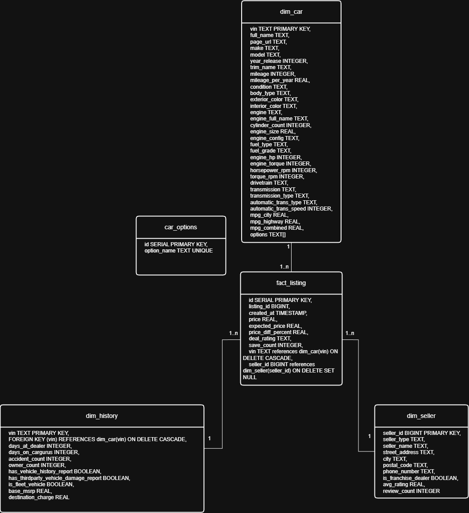
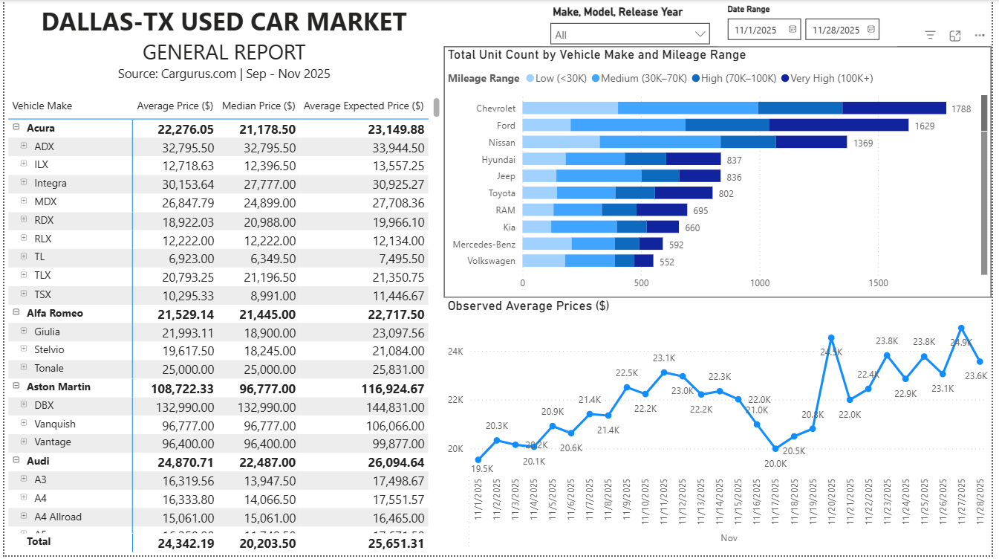

# Dallas-TX Used Car Market Analysis
### This project is an end-to-end analysis of used car data collected from [CarGurus.com](https://www.cargurus.com/) and filtered to only the 75081 postal area and its local vicinity within a 50-mile radius. The project consists of a complete ETL pipeline to build the dataset, analysis reports to gain insights, as well as data visualizations using BI tool.

## Pipeline Operation Procedure
- `main_extract.py` retrieves data of used cars (price, specifications, history record, seller information) from CarGurus APIs. Fetched data, formatted as JSON files, is then stored into an intermediary [MinIO](https://www.min.io/) object store.
- `main_transform.py` reads JSON data files from the object store and combines them into one [pandas](https://pandas.pydata.org/) DataFrame. Next, the data is cleaned and enriched:
    - Records that lack essential data fields such as VIN number, price, car make, car model are discarded
    - Extra computed fields such as mileage per year are added to each record
    - Fields are cast to their expected data types
    - Transformed data records are stored back into the object store as a single combined csv file
- `main_load.py` reads the combined csv file from the object store into a pandas DataFrame, and performs necessary type casts before loading all data into a Postgres database. New data records are appended, while existing records are updated with newer data.
- `main_orchestrate.py` defines the [Airflow](https://airflow.apache.org/) DAG that schedules the automated execution of the three Python scripts above. The pipeline is scheduled to run once every two hours, and the data of each run is handled separately within that run.
- The data pipeline operates on a local server, with the object store and database components running in Docker containers, and scripts are scheduled to automatically execute by a local Apache Airflow instance.

## Data Modelling

- Above is the star schema presenting how the data is organized inside the database
- For each used car data record, the one fact table holds frequently-changing fields like `price` and `save_count`, whereas the other dimension tables are for fixed/rarely-updated fields about the car specifications, history, and seller.

## Data Analysis & Visualization
- A market overview report along with general visualizations were performed in [Used-Car-Market-Report.pbix](Used-Car-Market-Report.pbix) with Power BI (Please download for interactive visualizations)

- More detailed analyses with concluded insights were performed in [market-analysis.ipynb](data-analysis/market-analysis.ipynb) using SQL queries and [matplotlib](https://matplotlib.org/) visualizations